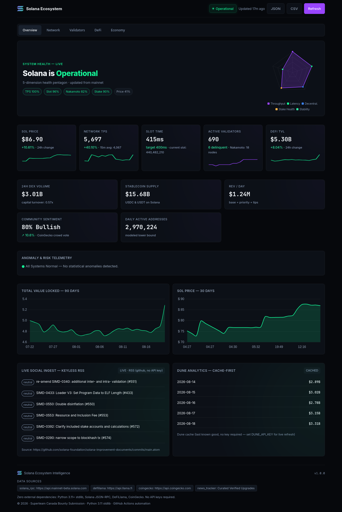
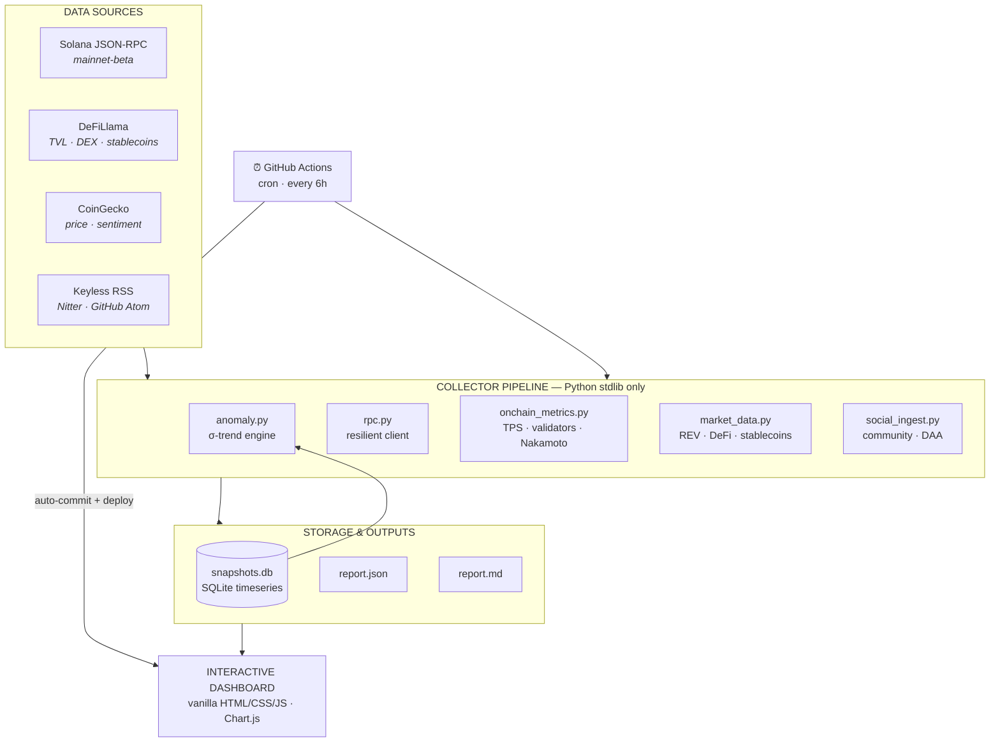

<div align="center">


# Solana Orbit

**Ecosystem Intelligence — an auto-updating report & interactive dashboard for the Solana network.**

Live on-chain telemetry · Explainable anomaly detection · Zero dependencies · Zero API keys

[](run.py)
[](collector/)
[](SECURITY.md)
[](tests/)
[](.github/workflows/refresh.yml)
[](LICENSE)

**[View Live Dashboard →](https://dashboard-flame-gamma-14.vercel.app)**

</div>

---



## Overview

Solana Orbit continuously ingests live data from Solana's JSON-RPC API, DeFiLlama, and CoinGecko, compiles it into a persistent SQLite timeseries, and publishes three synchronized outputs:

| Output | Format | Audience |
|---|---|---|
| **Interactive Dashboard** | HTML · Chart.js · dark theme | Humans — [live demo](https://dashboard-flame-gamma-14.vercel.app) |
| **Structured Report** | [`data/report.json`](data/report.json) | Machines & agents |
| **Narrative Report** | [`data/report.md`](data/report.md) | Readers & reviewers |

Everything runs on the **Python 3.11 standard library alone** — no `pip install`, no node modules, no API keys, no vendor lock-in. Clone it, run it, done.

---

## Architecture



**Pipeline modules** — `rpc` (transport) → `onchain_metrics` / `market_data` / `community_sentiment` / `daily_active_addresses` / `social_ingest` (domain collectors) → `db` (persistence) → `anomaly` (statistical analysis) → `report_builder` (JSON + Markdown compilation).

---

## Data Sources & Methodology

| Category | Source | What is collected |
|---|---|---|
| **Network performance** | `api.mainnet-beta.solana.com` | TPS (current, non-vote, 15m avg) via `getRecentPerformanceSamples`, slot time via `getBlockTime`, epoch progress via `getEpochInfo` |
| **Validators & decentralization** | `getVoteAccounts` | Active/delinquent counts, active stake in SOL, top validators by stake, commission distribution, **Nakamoto Coefficient** (min validators to control 33.3% of stake) |
| **Cluster health & supply** | `getHealth`, `getSupply` | Node health, circulating vs staked SOL ratio |
| **DeFi & liquidity** | `api.llama.fi` | Live Solana TVL, 30-day TVL history, 24h DEX volume, top Solana-native protocols, stablecoin supply |
| **Market valuation** | CoinGecko (Binance fallback) | SOL/USD spot, 24h change, market cap, volume |
| **Real Economic Value** | Derived in `market_data.py` | `(daily non-vote tx × median fee) + Jito MEV tip flow` — formula documented in-code |
| **Median transaction fee** | `getRecentPrioritizationFees` | Live RPC sampling with explicit modeled fallback |
| **Community sentiment** | CoinGecko crowd vote | `sentiment_votes_up_percentage`, correlated with on-chain momentum |
| **Daily active addresses** | `getSignaturesForAddress` → `getTransaction` | RPC fee-payer sampling extrapolated to a labeled **lower-bound model** |
| **Social signal** | Nitter RSS → GitHub Atom cascade | Keyless, never fabricated — reports `unavailable` if all endpoints fail |
| **Dune Analytics** | `api.dune.com` | Cache-first snapshot; live refresh when `DUNE_API_KEY` is set — **not required to run** |

---

## Anomaly Detection

The engine in [`collector/anomaly.py`](collector/anomaly.py) fits an exponential-smoothing trend baseline to trailing SQLite snapshots and flags deviations in standard deviations — every alert is explainable, not magic:

| Rule | Warning | Critical |
|---|---|---|
| TPS deviation from smoothed trend | > 2σ | > 3.5σ |
| Average slot time vs 400ms target | > 550ms | > 750ms |
| Delinquent stake share | > 2.0% | — |
| SOL 24h move vs momentum baseline | > 2σ / > 10% | > 20% |
| DeFi TVL 24h drawdown | > 10% | — |
| Cluster health | RPC degraded | RPC unreachable |

A composite **network stress index** blends recent TPS drop, slot-time rise, and TVL drawdown into one headline risk score. Alerts surface as structured objects in `report.json`, highlighted callouts in `report.md`, and severity-badged entries in the dashboard.

Run the engine's self-tests against synthetic stress scenarios:

```bash
python3 -m collector.anomaly
```

---

## Automation

[`.github/workflows/refresh.yml`](.github/workflows/refresh.yml) closes the loop:

1. **Trigger** — cron every 6 hours (`0 */6 * * *`), plus manual `workflow_dispatch`
2. **Collect** — Ubuntu runner executes `python3 run.py`
3. **Commit** — refreshed `report.json`, `report.md`, and `snapshots.db` are auto-committed with `[skip ci]`
4. **Deploy** — dashboard auto-deploys to Vercel (connected repo, `outputDirectory: dashboard`)

In the browser, the dashboard also polls CoinGecko every 60s for a `· LIVE ·` price ticker, while `Generated at` in the JSON remains the auditable backend stamp.

---

## Quick Start

**Prerequisites:** Python 3.11+ and a browser. That's it.

```bash
git clone https://github.com/Edgywol/Solana_Ecosystem.git
cd Solana_Ecosystem

# Collect live data and compile reports
python3 run.py

# Serve the dashboard
python3 -m http.server 8000
```

Open **http://localhost:8000/dashboard/**.

**Optional environment variables:**

| Variable | Purpose |
|---|---|
| `SOLANA_RPC_URL` / `SOLANA_RPC_URLS` | Custom or multi-endpoint RPC (N-of-M consensus) |
| `DUNE_API_KEY` | Enables live Dune refresh (otherwise cache-only) |

**Run the test suite:**

```bash
python3 -m unittest discover -s tests
```

---

## Project Structure

```
├── run.py                     # One-command entrypoint: collect → analyze → report
├── collector/
│   ├── rpc.py                 # Resilient JSON-RPC client (gzip, failover, backoff)
│   ├── rpc_orchestrator.py    # Multi-endpoint consensus
│   ├── onchain_metrics.py     # TPS, epoch, validators, Nakamoto coefficient
│   ├── market_data.py         # Prices, DeFi TVL, stablecoins, REV
│   ├── community_sentiment.py # Keyless crowd sentiment
│   ├── daily_active_addresses.py # RPC-sampled DAA model
│   ├── social_ingest.py       # RSS cascade (Nitter → GitHub Atom)
│   ├── dune.py                # Cache-first Dune integration
│   ├── anomaly.py             # Exponential-smoothing anomaly engine
│   ├── db.py                  # SQLite timeseries + snapshot quarantine
│   └── report_builder.py      # JSON + Markdown report compiler
├── dashboard/                 # Static dashboard (deployed to Vercel)
│   ├── index.html · styles.css · app.js
│   └── report.json            # Data consumed by the UI
├── data/                      # Generated artifacts (auto-committed)
│   ├── report.json · report.md · snapshots.db
├── tests/                     # Unit tests (anomaly engine + pipeline)
└── .github/workflows/refresh.yml  # 6-hour automation loop
```

---

## Honest Scope

Transparency is a feature. What is real, modeled, or not collected is declared explicitly in [`data/report.json`](data/report.json) under `coverage`:

- **Tokenized equities** — no free keyless API exists; declared in `coverage.not_collected`, DEX volume shown as proxy
- **Daily active addresses** — real RPC sample extrapolated to a labeled lower-bound model (`daily non-vote txns ÷ 35`); authoritative DAA requires Dune/Flipside
- **Twitter/X** — enterprise API is paywalled; keyless RSS proxy used instead, never fabricated
- **Public RPC rate limits** — exponential backoff + snapshot quarantine built in; supply `SOLANA_RPC_URLS` for redundancy

Full threat-model and data-integrity practices: [SECURITY.md](SECURITY.md) · Design rationale: [DESIGN.md](DESIGN.md)

---

## Submission Requirements Mapping

Each item from the Superteam Canada listing is mapped to the artifact that satisfies it, so reviewers can verify coverage in one pass.

| # | Listing requirement | Where it lives |
|---|---|---|
| 1 | **Public GitHub repository** with all code, setup, and a clear `README.md` | This repo — `README.md` (you are reading it), [`run.py`](run.py), [`collector/`](collector/) |
| 2 | **Live demo or hosted version** of the interactive dashboard | [dashboard-flame-gamma-14.vercel.app](https://dashboard-flame-gamma-14.vercel.app) · auto-deployed by [`vercel.json`](vercel.json) + the GitHub Actions workflow |
| 3 | **Sample generated Markdown report** | [`data/report.md`](data/report.md) — narrative report committed on every refresh |
| 4 | **Sample generated JSON report** | [`data/report.json`](data/report.json) — structured report consumed by the dashboard |
| 5 | **Write-up: data sources & integration** | [Data Sources & Methodology](#data-sources--methodology) above · [DESIGN.md](DESIGN.md) |
| 6 | **Write-up: automation strategy** | [Automation](#automation) above (cron, `workflow_dispatch`, auto-commit, auto-deploy) |
| 7 | **Write-up: anomaly detection** | [Anomaly Detection](#anomaly-detection) above · implementation in [`collector/anomaly.py`](collector/anomaly.py) |
| 8 | **Write-up: setup & run instructions** | [Quick Start](#quick-start) above (`git clone` → `python3 run.py` → serve `dashboard/`) |

**Bonus requirements from the listing that are also satisfied:**

- **Dune Analytics integration** — [`collector/dune.py`](collector/dune.py) (cache-first; live when `DUNE_API_KEY` is set, optional)
- **Keyless Twitter/X coverage** — [`collector/social_ingest.py`](collector/social_ingest.py) (Nitter RSS → GitHub Atom cascade; reports `unavailable` instead of fabricating)
- **Nakamoto coefficient** — derived in [`collector/onchain_metrics.py`](collector/onchain_metrics.py)
- **Tokenized equity proxy** — DEX volume from DeFiLlama used as proxy (declared in `coverage.not_collected`; see [Honest Scope](#honest-scope))
- **Composite network stress index** — built in [`collector/anomaly.py`](collector/anomaly.py), surfaced as headline risk score in the dashboard

---

## License

[MIT](LICENSE) — free to use, fork, and build upon.

<div align="center">
<br/>
<sub><b>Solana Orbit</b> — Ecosystem Intelligence · built for the Solana community</sub>
</div>
